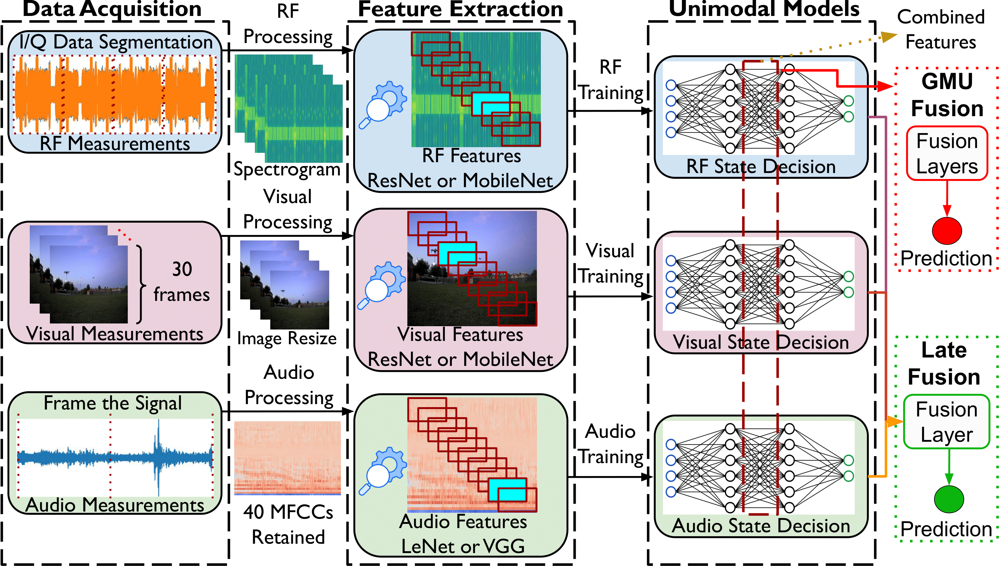

# TRIDENT
## Description
TRIDENT is a multi-sensor framework that integrates audio, visual, and RF data for robust drone (UAV) detection. This repository contains the code, datasets, and documentation necessary to reproduce the results presented in our paper, `TRIDENT: Tri-modal Real-time Intrusion Detection Engine for New Targets`.

## Abstract

This repository implements a tri-modal detection approach that leverages three complementary sensor streams—audio, video, and RF—to reliably detect drones under diverse conditions. Our fusion strategies (**Late** and **GMU Fusion**) efficiently combine the extracted features from each modality, achieving real-time performance on resource-constrained devices. Experimental evaluations, conducted on a multi-sensor testbed, demonstrate high accuracy and robustness even in noisy and occluded scenarios.

This repository includes all necessary code, datasets, and documentation to reproduce the results and explore the TRIDENT framework under different scenarios.

## Supported Environments and Hardware Requirements
The code and models are supported on the following environments and hardware configurations:
- `Operating Systems` : Windows 11/Ubuntu 22.04.  
- `Python Version` : 3.x
- `Training Hardware` :
  - `GPU` : GeForce GTX 1080 Ti
- `Testing Hardware` : 
  - `CPU` : 6-core (or more) ARM Cortex-A78AE / equivalent desktop CPU
  - `GPU` : NVIDIA Jetson Orin Nano or similar
  - `Memory` : 8 GB RAM
- `Sensors` :
  - Microphone (e.g., Samson Meteor)
  - Camera (e.g., Marshall CV-505)
  - SDRs (e.g., USRP B210, B200 Mini)

> **Note:** While these are the components we used and validated for TRIDENT, you can modify the setup to suit your environment. The key requirement is ensuring sufficient computational resources and sensor quality to handle real-time drone detection.

# Repository Structure
The structure of the repository is aligned with the process flow of our TRIDENT framework, as illustrated in the following diagram:

<div align="center">

</div>


This repository is organized into the following folders:

```plaintext
TRIDENT/
├── dataset/
│   ├── get_dataset.py       # Handles data loading and custom Dataset classes
│   ├── get_transform.py     # Defines data preprocessing & augmentation transforms
├── models/
│   ├── aux_models.py        # Auxiliary model components or utilities
│   ├── av_fusion.py         # Late and GMU Fusion classes for combining modalities
│   ├── get_model.py         # Model factory function to instantiate different architectures
│   ├── inflated_resnet.py   # 3D/Inflated ResNet for video/RF frames
│   ├── unimodel_audio.py    # Audio-specific model definitions
│   ├── unimodel_seq.py      # Sequential visual/RF models
│   └── resnet/
│       ├── bottleneck.py    # Bottleneck module for ResNet
│       └── resnet.py        # Core ResNet definitions
├── training/
│   ├── unimodal_train.py    # Internal functions for unimodal training/testing loops
│   ├── multimodal_train.py  # Internal functions for dual/triple-modal training/testing loops
├── utils/
│   ├── functions.py         # Shared utility functions (e.g., saving model, counting parameters)
│   ├── scheduler.py         # Custom learning rate schedulers or scheduling logic
├── unimodal_train.py        # Main script for training a unimodal model (audio, visual, or RF)
├── unimodal_test.py         # Main script for testing a unimodal model
├── fusion_train.py          # Main script for training multi-modal fusion (Late or GMU Fusion)
├── fusion_test.py           # Main script for testing multi-modal fusion
├── TRIDENT_env.yml          # Python dependencies
└── README.md                # Project documentation
```
# Dataset
The dataset (10GB) is not stored in this repository due to size.
- Access: You can download the dataset from this link: [Download Dataset from Google Drive](https://drive.google.com/drive/folders/12fRKBzepelfA4897mKtPerIv6-TJyGqg?usp=sharing).
  - Contents: Audio files in .wav format, video frame images, and RF spectrogram images (generated from I/Q data) in .jpg format. All files from different modalities are collected in a synchronized and correlated manner.

# How to Run
To reproduce the main experiment presented in the paper, follow these steps:

## Prerequisites
Before you begin, ensure you have met the following requirements:
- **Python version:** 3.x
- **Dependencies:** All necessary dependencies are listed in the TRIDENT_env.yml file.

## Setting Up the Environment
To set up the environment, you can use the TRIDENT_env.yml file:
```bash
conda env create -f TRIDENT_env.yml
conda activate <your-environment-name>
```
## Training and Evaluating the Models
This describes how to train and evaluate unimodal, dual-modal, and tri-modal fusion models for drone detection using audio, video, and RF data.

### Unimodal Training & Testing
In our setup, LeNet and VGG-19 are used for audio, while ResNet-10 and MobileNet are used for video and RF. No pretrained weights are used—everything is trained from scratch.
#### Training a Unimodal Model
Use `unimodal_train.py` to train a single modality (audio = 0, video = 1, RF = 2). For example, train a LeNet model on Audio using: 
```bash
python unimodal_train.py --modal_num 0 --model_name_1 lenet --gpu 0 
```
**Key Args:**

- `--modal_num [0 | 1 | 2]`: Selects audio, video, or RF.
- `--model_name_1 [lenet | vgg]`: Audio model to use.
- `--model_name_2 [resnet10 | mobilenet]`: If training video.
- `--model_name_3 [resnet10 | mobilenet]`: If training RF.
- `--epochs`, `--batch-size`, `--learning_rate`, etc.: Adjust as needed.

The trained model checkpoint (`.pt` file) is saved to `TRIDENT/save_unimodals`.

#### Evaluating a Unimodal Model
Use `unimodal_test.py` to test a unimodal model. Make sure the corresponding checkpoint `.pt` file is in `TRIDENT/save_unimodals`, and that `--modal_num` and `--model_name_*` match what you trained:
```bash
python unimodal_test.py --modal_num 0 --model_name_1 lenet --gpu 0 
```
The evaluation results will be saved to `uni_results.csv`. Pretrained weights for unimodal models are available at: [Unimodal Pretrained Weights](https://drive.google.com/drive/folders/1dfBv9AvGHx1wb0MEy3zlObNAoonPfLpw?usp=sharing). Place the `.pt` weights into `TRIDENT/save_unimodals` and run the test script above to reproduce our reported results.

### Dual-Modal Fusion (Audio+Video, Audio+RF, Video+RF)
We offer two fusion strategies:
- **Late Fusion** (decision-level merging).
- **GMU (Gated Multimodal Unit)**, which fuses features at an intermediate level.
#### Training a Dual-Modal Model
Use `fusion_train.py` with `--type` set to `late` or `gmu`, and specify two modalities. For example, to train **audio+video** with Late Fusion:
```bash
python fusion_train.py --type late --model_1 lenet --model_2 resnet10 --epochs 20 --gpu 0
```
The script will look for `model_1` (audio), `model_2` (video), and `model_3` (RF). The checkpoint is saved in save_dual-modals.
#### Evaluating a Dual-Modal Model
Use `fusion_test.py`, specifying the same two modalities and fusion type:
```bash
python fusion_test.py --type late model_1 lenet --model_2 resnet10 --gpu 0
```
A .csv file (multi_results.csv) records the results. Pretrained combinations models (Late or GMU Fusion) for audio+video, audio+RF, video+RF can be found here: [Dual-Modal Pretrained Weights](https://drive.google.com/drive/folders/1fq_1xMZZigpwAyojQDWLLQ238-U9lwDc?usp=sharing). Download the `.pt` files and place them in `save_dual-modals` (or your chosen folder), then run the test script.

### Tri-Modal Fusion (Audio+Video+RF)
For tri-modal scenarios, we also support both Late and GMU Fusion.
#### Training a Tri-Modal Model
Use `fusion_train.py` with `--type late_3_modal` or `gmu_3_modal` and specify three models:
```bash
python fusion_train.py --type gmu_3_modal --model_1 lenet --model_2 resnet10 --model_3 mobilenet --epochs 20 --gpu 0
```
Checkpoints are saved in `save_tri-modals` by default.
#### Evaluating a Tri-Modal Model
Use `fusion_test.py` with `--type [late_3_modal | gmu_3_modal]` and the matching model names:
```bash
python fusion_test.py --type gmu_3_modal --model_1 lenet --model_2 resnet10 --model_3 mobilenet --gpu 0
```
A .csv file (multi_results.csv) logs the results for the test split. Link for the tri-modal Late and GMU Fusion weights is provided here: [Tri-Modal Pretrained Weights](https://drive.google.com/drive/folders/1gQ_9lr8F1Uhh-IJwo_xPtQOj3Awn2WCD?usp=sharing). Place the `.pt` files in `save_tri-modals`. You can then directly test them with fusion_test.py.

## Expected Output
Running the `fusion_test.py` script (for example, with three modalities) generates CSV File (multi_results.csv), which includes columns such as:
- Fusion (e.g., late_3_modal or gmu_3_modal)
- Model_1 (audio model, e.g., lenet or vgg)
- Model_2 (visual model, e.g., resnet10 or mobilenet)
- Model_3 (RF model, e.g., resnet10 or mobilenet)
- Acc (accuracy)
- Recall
- Precision
- F1-score
- F1-macro
- Avg Detection Time (seconds per inference)
- Confusion Matrix, showing the distribution of predictions across the drone vs. non-drone classes. 

An entry in the `.csv` might look like:

| Fusion        | Model_1 | Model_2  | Model_3  |   Acc   | Recall | Precision | Avg Precision | F1-score | F1-macro | Avg Pred Time |
|---------------|---------|----------|----------|--------:|-------:|----------:|---------------:|---------:|---------:|---------------:|
| late_3_modal  | lenet   | mobilenet| resnet10 |  0.9962 | 0.9940 |     1.0000 |         0.6326 |   0.9970 |   0.9959 |         0.0060 |


**Confusion Matrix of this combinations is:**
```plaintext
[[835   5]
 [  0 480]]
```
> **Note:** All results for unimodal, dual-modal, and tri-modal fusion are provided here: [Results](https://drive.google.com/drive/folders/1s8L-Lara6oy6RgfC89h2CxoWajhHNDgD?usp=sharing).

## Documentation and Support
For detailed instructions on setting up the environment, running experiments, and interpreting results, please refer to the documentation and the paper. If you encounter any issues or have questions, feel free to open an issue in this repository.

## Citation
If you use this code in your research, please cite the following paper:


